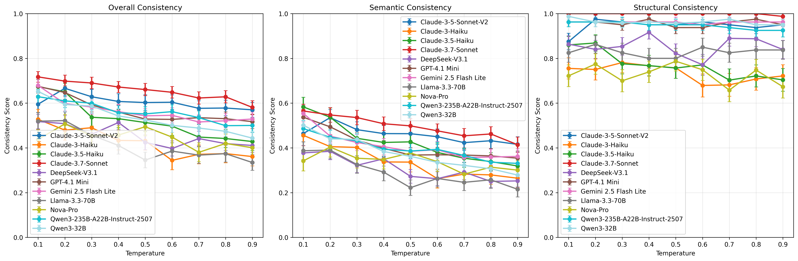

# STED and Consistency Scoring: A Framework for Evaluating LLM Structured Output Reliability

A comprehensive framework for evaluating and improving consistency in LLM-generated structured outputs. This framework combines STED (Semantic Tree Edit Distance), a novel similarity metric that balances semantic flexibility with structural strictness, with a consistency scoring framework that aggregates multiple STED measurements to quantify output reliability.

> 📄 **Paper**: Accepted at NeurIPS 2025 Workshop on Structured Probabilistic Inference & Generative Modeling

## Table of Contents

- [Overview](#overview)
- [Key Features](#key-features)
- [Installation](#installation)
- [Quick Start](#quick-start)
- [Dataset](#dataset)
- [STED Effectiveness Verification](#sted-effectiveness-verification)
- [LLM Consistency Benchmarking](#llm-consistency-benchmarking)
- [Key Components](#key-components)
- [Results and Findings](#results-and-findings)
- [MCP Server for Agentic Systems](#mcp-server-for-agentic-systems)
- [Contributing](#contributing)
- [Citation](#citation)

## Overview

Large Language Models (LLMs) are increasingly deployed for structured data generation tasks, yet their output consistency remains a critical challenge for production applications. This framework addresses this challenge through two key contributions:

1. **STED (Semantic Tree Edit Distance)**: A novel similarity metric that balances semantic flexibility with structural strictness when comparing JSON outputs
2. **Consistency Scoring Framework**: Aggregates multiple STED measurements across repeated generations to quantify output reliability

Through systematic experiments on synthetic datasets with controlled schema, expression, and semantic variations, STED achieves superior performance (0.86–0.90 similarity for semantic equivalents, 0.0 for structural breaks) compared to existing metrics including TED, BERTScore, and DeepDiff.

## Key Features

- **Semantic Tree Edit Distance (STED)**: Advanced similarity calculation combining structural and semantic analysis
- **Multiple Variation Types**: Support for schema, expression, and semantic variations
- **LLM Benchmarking**: Comprehensive evaluation of different LLMs across temperature settings
- **MCP Server Support**: Model Context Protocol server for real-time consistency evaluation in agentic systems
- **Synthetic Dataset Generation**: Automated generation of variation datasets for evaluation
- **Visualization Tools**: Rich plotting and analysis capabilities for results interpretation

## Installation

```bash
# Clone the repository
git clone https://github.com/amazon-science/sted.git
cd sted

# Install the library
pip install -e .

# Or with uv
uv pip install -e .
```

For development:
```bash
pip install -e ".[dev]"
# Or: uv sync
```

### Credentials Setup

**AWS Credentials** (for Bedrock embedding models):
```bash
aws configure
# Or set: AWS_ACCESS_KEY_ID, AWS_SECRET_ACCESS_KEY, AWS_DEFAULT_REGION
```

**OpenAI API Key** (optional, for OpenAI model evaluation):
```bash
export OPENAI_API_KEY=<your-openai-api-key>
```

### Troubleshooting

**NumPy/PyTorch Compatibility Error**

If you see `_ARRAY_API not found` or "module compiled using NumPy 1.x cannot be run in NumPy 2.x":

```bash
# Option 1: Downgrade NumPy (if using PyTorch < 2.4)
pip install "numpy<2"

# Option 2: Upgrade PyTorch (recommended)
pip install --upgrade "torch>=2.4"
```

## Quick Start

### Basic Similarity Calculation

```python
from sted.semantic_json_tree_consistency import SemanticJsonTreeConsistencyEvaluator

# Initialize evaluator
evaluator = SemanticJsonTreeConsistencyEvaluator(
    model_id='amazon.titan-embed-text-v2:0'
)

# Compare JSON structures
json1 = {'name': 'John', 'age': 30, 'city': 'New York'}
json2 = {'name': 'John', 'age': 30, 'location': 'NYC'}

# Calculate similarity
similarity = evaluator.calculate_tree_edit_distance_opt(
    json1, json2, 
    variation_type="combined"
)
print(f"Similarity: {similarity:.4f}")  # Output: 0.8650
```

### Batch Consistency Evaluation

```python
from sted.semantic_json_tree_consistency import SemanticJsonTreeConsistencyEvaluator
from sted.structural_consistency_analyzer import StructuralConsistencyAnalyzer

evaluator = SemanticJsonTreeConsistencyEvaluator(model_id='amazon.titan-embed-text-v2:0')
analyzer = StructuralConsistencyAnalyzer(evaluator)

# Multiple LLM outputs for the same prompt
json_outputs = [
    {'name': 'Alice', 'age': 25, 'city': 'New York'},
    {'name': 'Alice', 'age': 25, 'city': 'NYC'},
    {'name': 'Alice', 'age': 25, 'location': 'New York City'},
]

result = analyzer.evaluate_structural_consistency(
    json_outputs, method_name="ted", variation_type="combined"
)
print(f"Consistency: {result['consistency_metrics']['consistency_coefficient']:.4f}")
```

For more examples, see `examples/basic_usage.py` and [Library Usage Guide](./LIBRARY_USAGE.md).

## Dataset

The framework uses ShareGPT datasets for evaluation:
- **sharegpt-structured-output-json**: 30 samples
- **sharegpt-quizz-generation-json-output**: 50 samples
- **Total**: 80 samples (75 valid after parsing error exclusion)

### Download ShareGPT Data

```bash
python scripts/data/download_sharegpt_data.py
```

### Generate Synthetic Datasets

```bash
python scripts/data/generate_synthetic_datasets.py --base-dataset-dir sharegpt_data
```

Creates three variation types:
- **Schema Variation**: Field name changes, structure flattening/nesting
- **Expression Variation**: Different expressions with same semantic meaning
- **Semantic Variation**: Changes in semantic content

## STED Effectiveness Verification

### Similarity Progression Analysis

```bash
python scripts/dataset_analysis/analyze_semantic_expression_variation_progression.py \
  synthetic_dataset/expression_variation_dataset_*.json \
  synthetic_dataset/semantic_variation_dataset_*.json \
  --output-dir results/variation_progression
```

### Visualization

```bash
# Expression and Semantic Variation
python scripts/visualization/visualize_progression_expression_semantic_separate_charts.py

# Schema Variation
python scripts/visualization/visualize_schema_variation_results.py
```

## LLM Consistency Benchmarking

### Step 1: Generate LLM Outputs

```bash
python scripts/eval/run_temperature_experiment.py \
  --data-dir sharegpt_data \
  --output-dir llm_gen_results \
  --run-num 10 \
  --model-id anthropic.claude-3-haiku-20240307-v1:0 \
  --include-schema
```

### Step 2: Calculate Consistency Metrics

```bash
python scripts/eval/calculate_consistency_metrics.py
```

### Step 3: Visualize Results

```bash
python scripts/visualization/visualize_consistency_scores.py
```



### Adding New Models

The framework supports models from multiple providers. To add a new model, update the `provider_mapping` in `scripts/eval/generate_structured_outputs.py`:

```python
provider_mapping = {
    # AWS Bedrock models (use cross-region inference prefix "us." for supported models)
    "us.anthropic.claude-3-7-sonnet-20250219-v1:0": "bedrock",
    "us.anthropic.claude-sonnet-4-20250514-v1:0": "bedrock",
    "us.qwen.qwen3-235b-a22b-2507-v1:0": "bedrock",
    "us.deepseek.v3-v1:0": "bedrock",
    
    # OpenAI-compatible API models (via OPENAI_BASE_URL)
    "openai/gpt-4o": "openai",
    "google/gemini-2.5-pro": "openai",
    "x-ai/grok-4": "openai"
}
```

**Provider Types:**

| Provider | Model ID Format | API Used | Credentials |
|----------|----------------|----------|-------------|
| `bedrock` | `us.<provider>.<model>-v1:0` | AWS Bedrock Converse API | AWS credentials |
| `openai` | `<provider>/<model>` | OpenAI-compatible API | `OPENAI_API_KEY`, `OPENAI_BASE_URL` |

**To add a new model:**

1. **For Bedrock models**: Add the model ID with `"bedrock"` as the provider. Use the `us.` prefix for cross-region inference.
   ```python
   "us.meta.llama3-3-70b-instruct-v1:0": "bedrock",
   ```

2. **For OpenAI-compatible APIs** (OpenAI, OpenRouter, etc.): Add the model ID with `"openai"` as the provider.
   ```python
   "anthropic/claude-3-opus": "openai",  # via OpenRouter
   ```

3. **Configure credentials** in `.env`:
   ```bash
   # For OpenAI-compatible APIs
   OPENAI_API_KEY=<your-api-key>
   OPENAI_BASE_URL=https://openrouter.ai/api/v1  # Optional, for OpenRouter
   ```

For all scripts, see [Scripts Reference](./SCRIPTS_REFERENCE.md).

## Key Components

### STED Algorithm

STED extends classical tree edit distance with semantic awareness:

- **Semantic-Enhanced Tree Edit Distance**: Recognizes equivalent keys and values while preserving structural constraints
- **Order-Invariant Matching**: Uses Hungarian algorithm for optimal element pairing in O(n³) time
- **Multi-Level Similarity**: Integrates structural, key, value, and type similarities with configurable weights

The semantic update cost: `γ_upd(v1, v2) = w_s · γ_struct(v1, v2) + w_c · γ_content(v1, v2)`

### Variation Types

| Type | Description | Example |
|------|-------------|---------|
| Schema | Field name/structure changes | `"user_name"` → `"userName"` |
| Expression | Linguistic variations, same meaning | `"good book"` → `"nice book"` |
| Semantic | Content meaning changes | Should trigger alerts |

### Algorithm Complexity

- Tree construction: O(n)
- Embedding computation: O(k) with caching
- Optimized STED: O(n₁ × n₂ × (n₁ + n₂))
- Hungarian algorithm: O(max(n₁, n₂)³)

See [STED Complexity Analysis](./docs/api/sted_complexity_analysis.md) for details.

## Results and Findings

Evaluated **10 LLMs** across multiple temperature settings:

| Provider | Models |
|----------|--------|
| Anthropic | Claude 3 Haiku, Claude 3.5 Haiku, Claude 3.7 Sonnet |
| Amazon | Nova Pro v1 |
| Meta | Llama 3.3 70B |
| OpenAI | GPT-4.1 Mini |
| Google | Gemini 2.5 Flash Lite |
| DeepSeek | DeepSeek v3 |
| Alibaba | Qwen3 32B, Qwen3 235B A22B |

**Scale**: 10 models, 127 temperature settings, ~10,160 outputs, ~30,480 consistency calculations

See [LLM Benchmarking Results](./docs/LLM_BENCHMARKING_RESULTS.md) for detailed findings.

## MCP Server for Agentic Systems

Model Context Protocol server for real-time consistency evaluation:

```bash
cd mcp_dev
python test_client.py
```

**Tools available**:
- `evaluate_consistency`: Compare two JSON structures
- `evaluate_batch_consistency`: Evaluate multiple structures
- `evaluate_tool_calls`: Evaluate agent tool call consistency

See [mcp_dev/README.md](./mcp_dev/README.md) for integration details.

## Contributing

1. Fork the repository
2. Create a feature branch
3. Make your changes
4. Add tests if applicable
5. Submit a pull request

## Citation

If you use this framework in your research, please cite:

```bibtex
@inproceedings{wang2025sted,
  title={STED and Consistency Scoring: A Framework for Evaluating LLM Structured Output Reliability},
  author={Wang, Guanghui and Yu, Jinze and Zhang, Xing and Jiang, Dayuan and Deb, Tomal and Liu, Xuefeng and He, Peiyang and Song, Yin},
  booktitle={NeurIPS 2025 Workshop on Structured Probabilistic Inference \& Generative Modeling},
  year={2025}
}
```
